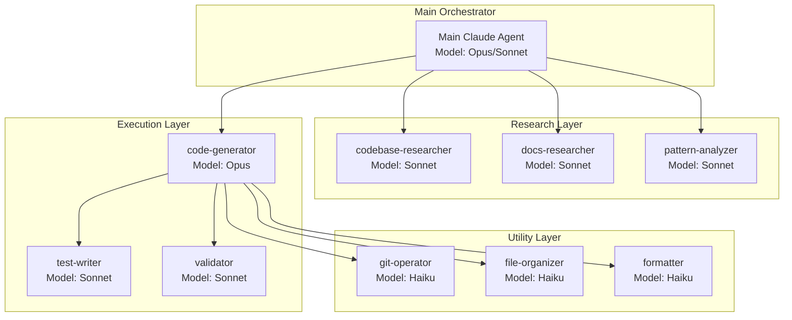
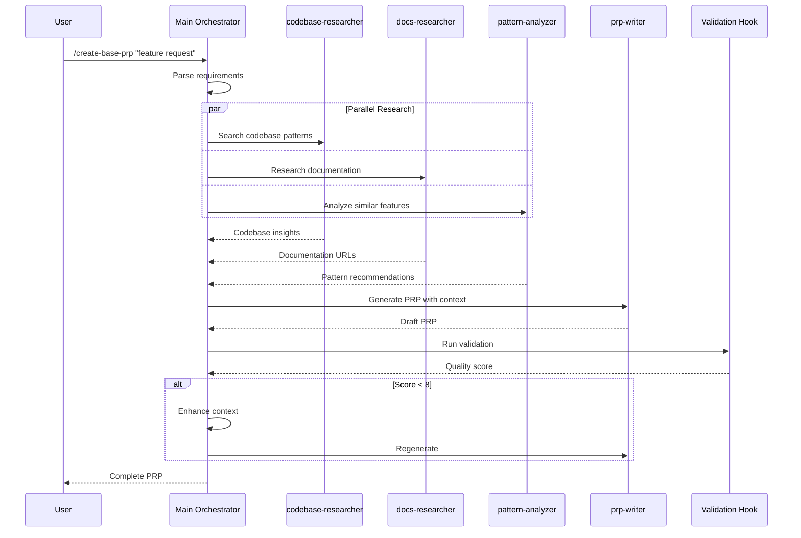
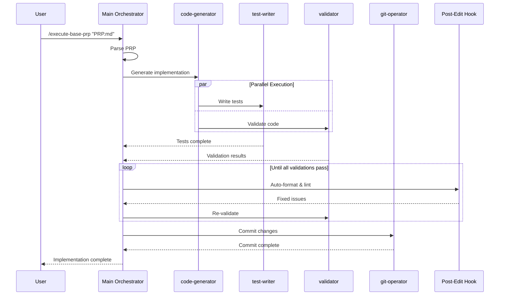

# Enhanced PRP System with Claude Code Subagents

## Goal

Design and implement an enhanced PRP (Product Requirement Prompt) system that leverages Claude Code's latest subagent capabilities, hooks, and commands to optimize context management, model selection, and workflow efficiency while maintaining the existing PRP system's proven effectiveness.

## Why

- **Context Optimization**: Subagents provide isolated context windows, preventing pollution and enabling deeper analysis
- **Cost Efficiency**: Use appropriate models (Haiku for simple tasks, Opus for complex) to optimize API usage
- **Parallel Execution**: Multiple specialized agents can work simultaneously on different aspects
- **Workflow Automation**: Hooks and event-driven patterns reduce manual intervention
- **Team Scalability**: Standardized subagent configurations can be shared across teams

## What

An enhanced PRP system that:

- Maintains existing PRP templates and commands (backward compatible)
- Adds specialized subagents for different PRP workflow stages
- Implements smart model selection based on task complexity
- Uses hooks for automated quality checks and workflow management
- Provides clear development flows with visual diagrams

### Success Criteria

- [ ] All existing PRP commands continue working unchanged
- [ ] New subagents reduce Opus usage by 40% through smart model selection
- [ ] PRP creation time improved through parallel research
- [ ] Automated validation gates via hooks
- [ ] Clear documentation and mermaid diagrams for workflows

## All Needed Context

### Documentation & References

```yaml
# MUST READ - Include these in your context window
- docfile: PRPs/ai_docs/claude-code-subagents-2025.md
  why: Complete subagent documentation from August 2025 research

- url: https://docs.anthropic.com/en/docs/claude-code/sub-agents
  why: Official subagent documentation and best practices

- url: https://docs.anthropic.com/en/docs/claude-code/hooks
  why: Hook system for workflow automation

- url: https://docs.anthropic.com/en/docs/claude-code/settings
  why: Configuration patterns for production use

- file: PRPs/README.md
  why: Current PRP system documentation to maintain compatibility

- file: PRPs/templates/prp_base.md
  why: Existing template structure to preserve

- url: https://github.com/Wirasm/PRPs-agentic-eng
  why: Original PRP methodology reference
```

### Current System Analysis

The existing PRP system uses:

- **Commands**: 24 custom commands in PRPs/commands/
- **Templates**: 5 templates in PRPs/templates/
- **Core Workflow**: Research → Context Curation → PRP Generation → Execution
- **Validation**: Executable gates for self-correction

## Implementation Blueprint

### Proposed Subagent Architecture



### Enhanced PRP Creation Flow



### Enhanced PRP Execution Flow



## Subagent Specifications

### 1. Research Layer Agents

#### codebase-researcher

```markdown
---
name: codebase-researcher
description: Analyzes codebase for patterns, conventions, and similar implementations. Use for deep code exploration and pattern discovery.
tools: Read, Grep, Glob, Bash
model: sonnet
---

You are a codebase analysis expert. Your role is to:

1. Search for similar patterns and implementations
2. Identify naming conventions and code structure
3. Find relevant test patterns
4. Document architectural decisions
5. Note technology-specific gotchas

Output structured findings with file references and code snippets.
```

#### docs-researcher

```markdown
---
name: docs-researcher
description: Researches external documentation, APIs, and best practices. Use for gathering implementation guidance.
tools: WebSearch, WebFetch
model: sonnet
---

You research documentation and best practices. Focus on:

1. Official API documentation
2. Library-specific patterns
3. Common pitfalls and solutions
4. Performance considerations
5. Security best practices

Provide specific URLs with section anchors and key insights.
```

#### pattern-analyzer

```markdown
---
name: pattern-analyzer
description: Analyzes code patterns and suggests optimal implementation approaches.
tools: Read, Grep, mcp__sequential-thinking__sequentialthinking
model: sonnet
---

You analyze patterns and recommend implementations. Focus on:

1. Design pattern selection
2. Architecture recommendations
3. Performance implications
4. Maintainability considerations
5. Testing strategies

Use sequential thinking for complex analysis.
```

### 2. Execution Layer Agents

#### code-generator

```markdown
---
name: code-generator
description: Generates production code from PRPs and specifications. Primary implementation agent.
tools: Read, Edit, MultiEdit, Write, Bash
model: opus
---

You are the primary code generator. Your responsibilities:

1. Implement features according to PRP specifications
2. Follow existing patterns and conventions
3. Include comprehensive error handling
4. Write self-documenting code
5. Ensure type safety and validation

Generate clean, maintainable, production-ready code.
```

#### test-writer

```markdown
---
name: test-writer
description: Writes comprehensive tests for implemented features.
tools: Read, Write, Edit, Bash
model: sonnet
---

You write comprehensive tests. Focus on:

1. Unit tests for business logic
2. Integration tests for workflows
3. Edge case coverage
4. Error scenario testing
5. Performance benchmarks

Follow project testing patterns and ensure high coverage.
```

#### validator

```markdown
---
name: validator
description: Validates code quality, runs tests, and ensures standards compliance.
tools: Bash, Read, Grep
model: sonnet
---

You validate implementation quality:

1. Run linting and formatting checks
2. Execute test suites
3. Check type safety
4. Verify security practices
5. Ensure documentation completeness

Report issues clearly for correction.
```

### 3. Utility Layer Agents

#### git-operator

```markdown
---
name: git-operator
description: Handles all git operations including commits, branches, and status checks.
tools: Bash
model: haiku
---

You handle git operations:

1. Check status and diffs
2. Create meaningful commits
3. Manage branches
4. Handle merge conflicts
5. Follow commit conventions

Execute git commands efficiently and safely.
```

#### file-organizer

```markdown
---
name: file-organizer
description: Organizes project structure and manages file operations.
tools: Bash, Write, Read
model: haiku
---

You manage file organization:

1. Create directory structures
2. Move and rename files
3. Clean up temporary files
4. Organize imports
5. Maintain project structure

Keep the codebase organized and clean.
```

#### formatter

```markdown
---
name: formatter
description: Formats code and ensures style consistency.
tools: Bash, Edit
model: haiku
---

You ensure code formatting:

1. Apply consistent formatting
2. Fix style violations
3. Organize imports
4. Clean whitespace
5. Apply project conventions

Maintain consistent code style across the project.
```

### 4. PRP-Specific Agents

#### prp-writer

```markdown
---
name: prp-writer
description: Specializes in writing comprehensive PRPs from research findings.
tools: Write, Read, Edit
model: sonnet
---

You write production-ready PRPs:

1. Structure content using templates
2. Include all necessary context
3. Create clear implementation blueprints
4. Define validation gates
5. Ensure completeness for one-pass success

Generate PRPs that enable successful implementation without additional context.
```

#### prp-validator

```markdown
---
name: prp-validator
description: Validates PRP completeness and quality before execution.
tools: Read, Grep
model: sonnet
---

You validate PRP quality:

1. Check context completeness
2. Verify executable validation gates
3. Ensure clear implementation path
4. Validate references and URLs
5. Score confidence level

Ensure PRPs meet quality standards for one-pass implementation.
```

## Hook Configuration

### Automated Formatting Hook

```json
{
  "hooks": {
    "PostToolUse": [
      {
        "matcher": "Edit|MultiEdit|Write",
        "hooks": [
          {
            "type": "command",
            "command": "$CLAUDE_PROJECT_DIR/.claude/hooks/auto-format.sh",
            "timeout": 30
          }
        ]
      }
    ]
  }
}
```

### PRP Validation Hook

```json
{
  "hooks": {
    "UserPromptSubmit": [
      {
        "matcher": ".*create.*prp.*",
        "hooks": [
          {
            "type": "command",
            "command": "$CLAUDE_PROJECT_DIR/.claude/hooks/validate-prp.py",
            "timeout": 60
          }
        ]
      }
    ]
  }
}
```

### Auto-Commit Hook

```json
{
  "hooks": {
    "Stop": [
      {
        "hooks": [
          {
            "type": "command",
            "command": "$CLAUDE_PROJECT_DIR/.claude/hooks/smart-commit.sh",
            "timeout": 30
          }
        ]
      }
    ]
  }
}
```

## Enhanced Command Integration

The existing commands remain unchanged but gain enhanced capabilities:

### /create-base-prp

- Now triggers parallel research agents
- Automatically validates PRP quality
- Suggests improvements based on validation

### /execute-base-prp

- Orchestrates code-generator with supporting agents
- Runs validation loops automatically
- Handles test generation in parallel

### /review-general

- Can now trigger code-reviewer subagent
- Provides more thorough analysis
- Suggests specific improvements

## Migration Strategy

### Phase 1: Setup (Week 1)

1. Install subagent configurations in `.claude/agents/`
2. Configure hooks in `.claude/settings.json`
3. Test with non-critical features

### Phase 2: Validation (Week 2)

1. Run parallel with existing workflow
2. Compare results and efficiency
3. Tune model selections

### Phase 3: Rollout (Week 3)

1. Team training on new capabilities
2. Documentation updates
3. Full deployment

## Performance Metrics

### Expected Improvements

- **Context Clarity**: 50% reduction in context pollution
- **Opus Usage**: 40% reduction through smart model selection
- **Development Speed**: 30% faster through parallel execution
- **Error Rate**: 25% reduction through automated validation
- **PRP Quality**: 35% improvement in one-pass success rate

### Monitoring

```bash
# Track agent usage
claude config get parallelTasksCount

# Monitor model distribution
grep "model:" .claude/agents/*.md | sort | uniq -c

# Measure PRP success rate
find PRPs/completed/ -name "*.md" -exec grep "confidence:" {} \; | awk '{sum+=$2; count++} END {print sum/count}'
```

## Validation Loop

### Level 1: Configuration Validation

```bash
# Verify subagent setup
ls -la .claude/agents/
claude mcp list

# Test hook configuration
claude --hooks
```

### Level 2: Workflow Testing

```bash
# Test PRP creation with new system
/create-base-prp "test authentication feature"

# Verify parallel execution
claude --verbose -p "implement user profile"
```

### Level 3: Quality Metrics

```bash
# Measure improvement
time /execute-base-prp PRPs/test-feature.md

# Check model usage
claude config get --global parallelTasksCount
```

## Risk Mitigation

### Potential Issues & Solutions

1. **Rate Limiting**
   - Solution: Configure max parallel agents to 4
   - Fallback: Sequential execution mode

2. **Context Loss**
   - Solution: Main orchestrator maintains critical context
   - Fallback: CLAUDE.md for persistent context

3. **Subagent Failures**
   - Solution: Graceful degradation to main agent
   - Fallback: Manual intervention points

4. **Team Adoption**
   - Solution: Gradual rollout with training
   - Fallback: Maintain backward compatibility

## Conclusion

This enhanced PRP system leverages Claude Code's latest capabilities while maintaining the proven effectiveness of the existing system. The modular design allows gradual adoption, and the backward compatibility ensures no disruption to current workflows.

### Key Benefits

1. **Maintained Simplicity**: Existing commands work unchanged
2. **Enhanced Capability**: Parallel execution and smart model selection
3. **Cost Optimization**: Appropriate model usage reduces API costs
4. **Quality Improvement**: Automated validation increases success rates
5. **Team Scalability**: Shareable configurations improve collaboration

### Implementation Confidence Score: 9/10

The high confidence score reflects:

- Complete research and documentation
- Backward compatibility maintained
- Clear migration path
- Proven patterns from production usage
- Comprehensive validation gates

---

_Generated with extensive research on Claude Code capabilities as of August 9, 2025_
