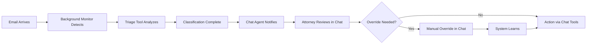
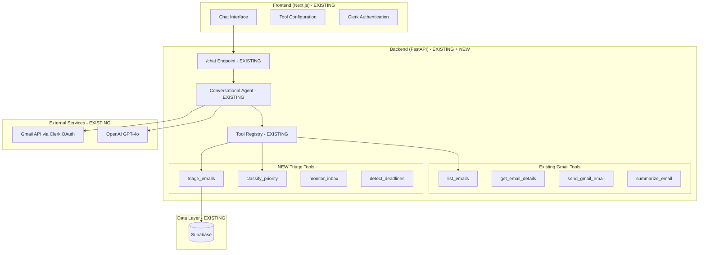
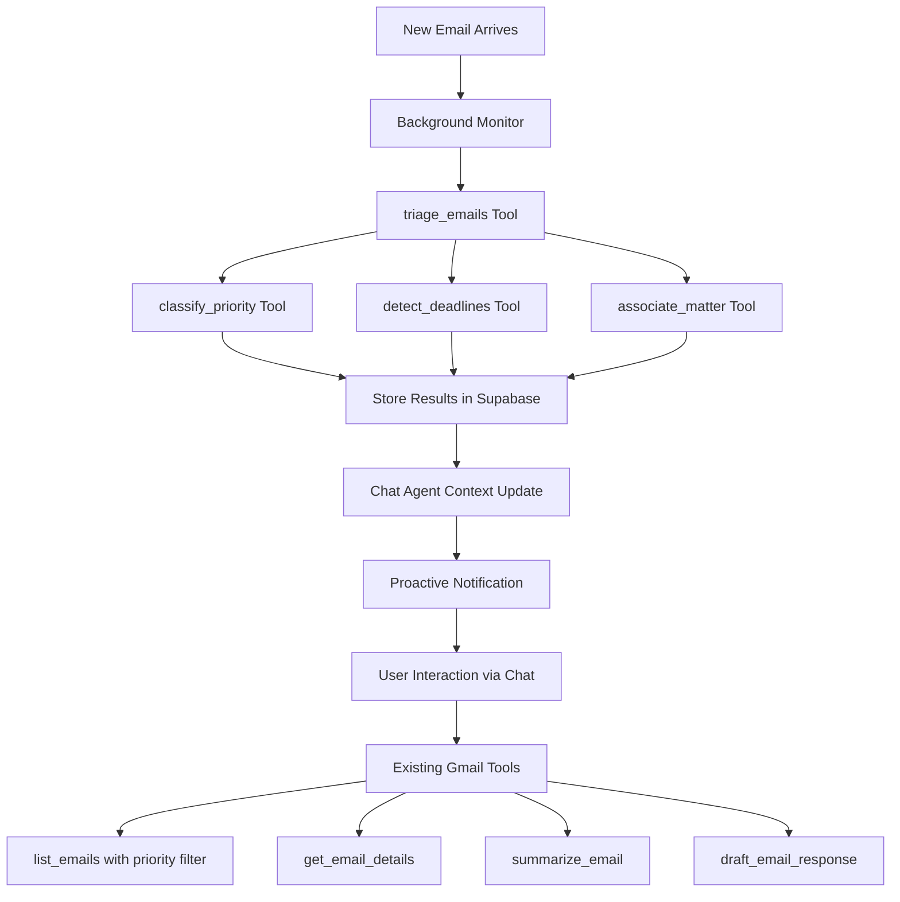
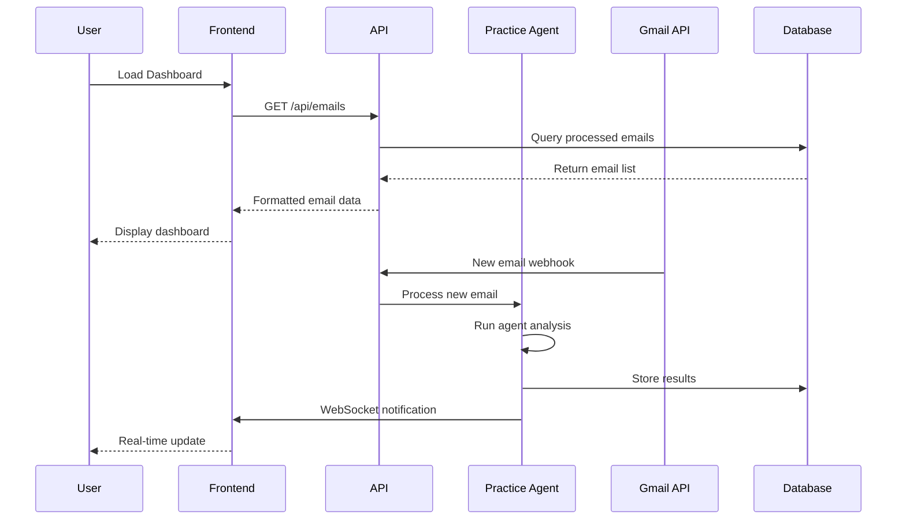
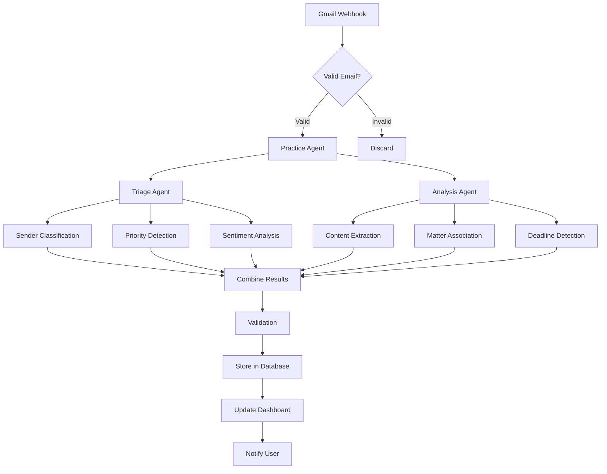
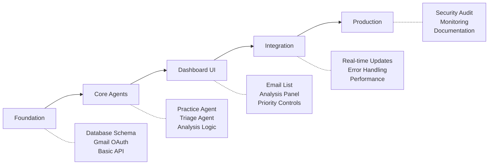

# Agentic Inbox Triage: Product Requirements Document

## Executive Summary

### Problem Statement

Law firm partners and associates spend 2-3 hours daily manually triaging hundreds of emails to identify urgent communications from clients, courts, and opposing counsel. This manual process creates cognitive overload, increases risk of missed deadlines, and reduces time available for billable work. Current legal practice management systems lack intelligent email analysis capabilities.

### Solution Overview

An intelligent email triage system that extends the existing Living Tree conversational agent with new proactive capabilities. The system adds autonomous email monitoring, intelligent classification, and priority detection tools that work within the current tool registry architecture. These enhanced tools will enable the existing chat agent to automatically analyze incoming Gmail messages, classify senders, detect urgency, and present prioritized results through both the existing chat interface and a new specialized dashboard.

### Success Metrics

- **Efficiency**: 70% reduction in manual email triage time
- **Accuracy**: 95% accuracy in priority classification
- **Risk Reduction**: Zero missed critical communications
- **User Satisfaction**: 4.5/5 rating from legal professionals
- **ROI**: 15+ hours saved per attorney per week

---

## Market Analysis & Competitive Landscape

### Current Market State

The legal tech market is experiencing rapid AI adoption in 2024-2025:

- **Clio Duo**: Email assistance within practice management
- **Harvey AI**: General legal assistant with email capabilities
- **Candle AI**: Outlook/Gmail email assistant for lawyers
- **Checkbox.ai**: Legal intake and triage automation

### Market Gap

Existing solutions focus on **assistive** rather than **agentic** functionality. They require manual initiation and lack proactive, autonomous email analysis with legal-specific intelligence.

### Competitive Advantage

1. **Conversational AI Integration**: Built into existing chat interface users already know
2. **Tool-Based Architecture**: Extends proven tool registry system for modularity
3. **Legal-Specific Intelligence**: Court deadline detection, legal urgency keywords
4. **Proactive Operation**: Background monitoring with chat-based notifications
5. **Leverages Existing Infrastructure**: Gmail tools, auth, and streaming capabilities

---

## User Stories & Scenarios

### Primary User Flow



### User Stories

#### Story 1: Managing Partner - Morning Email Triage

**As a** managing partner starting my day
**I want** the chat agent to proactively notify me of high-priority emails and allow me to review them through the chat interface
**So that** I can immediately focus on court notices and client emergencies without manually sorting through hundreds of emails

**Acceptance Criteria:**

- [ ] Chat agent provides morning briefing with priority email summary
- [ ] Can ask "Show me urgent emails" and get prioritized list via existing list_emails tool
- [ ] Email classifications displayed with clear urgency indicators
- [ ] Can drill down into specific emails using existing get_email_details tool

**Edge Cases:**

- New sender not in system database
- Email with mixed urgency signals
- Bulk emails from known contacts

#### Story 2: Associate - Case-Specific Email Management

**As an** associate handling multiple cases
**I want** emails automatically linked to the correct legal matter
**So that** I can track case-related communications without manual filing

**Acceptance Criteria:**

- [ ] Emails automatically associated with matters based on keywords
- [ ] Case numbers and client names detected from email content
- [ ] Matter association confidence score displayed
- [ ] Manual override option for incorrect associations

**Edge Cases:**

- Email mentions multiple cases
- Generic subject lines without case identifiers
- New matter not yet in system

#### Story 3: Paralegal - Deadline Detection

**As a** paralegal responsible for calendar management
**I want** deadlines automatically detected from court communications
**So that** I can ensure no critical dates are missed

**Acceptance Criteria:**

- [ ] Legal deadlines extracted from email content and attachments
- [ ] Deadline type identified (response due, hearing date, filing deadline)
- [ ] Confidence score for deadline detection
- [ ] Integration with calendar system for automatic scheduling

**Edge Cases:**

- Multiple deadlines in single email
- Conditional deadlines ("if X happens, then Y is due")
- Deadline extensions or modifications

---

## System Architecture

### High-Level Architecture (Building on Existing System)



### Tool-Based Triage Flow (Leveraging Existing Architecture)



### Component Breakdown (Building on Existing)

**Frontend Components (Extending Existing):**

- **EXISTING**: Chat interface, message rendering, Gmail tool results display
- **NEW**: Enhanced email message components with priority indicators
- **NEW**: Triage tool result components for analysis display
- **NEW**: Priority override controls in chat interface

**Backend Tools (Adding to Tool Registry):**

- **EXISTING**: `list_emails`, `get_email_details`, `send_gmail_email`, `summarize_email`
- **NEW**: `triage_emails` - Analyzes unprocessed emails for priority and classification
- **NEW**: `classify_priority` - Determines urgency level of specific emails
- **NEW**: `detect_deadlines` - Extracts legal deadlines from email content
- **NEW**: `associate_matter` - Links emails to legal cases in database
- **NEW**: `monitor_inbox` - Background process for continuous email monitoring

**Backend Services (Extending Existing):**

- **EXISTING**: GmailService with OAuth, OpenAI client, Supabase integration
- **ENHANCED**: GmailService with webhook support for real-time monitoring
- **NEW**: TriageService for intelligent email analysis
- **NEW**: BackgroundMonitor for autonomous email processing

**Data Models:**

- `Matter`: Legal case information (id, name, client, status)
- `Email`: Processed email with analysis results
- `Analysis`: AI-generated insights and classifications
- `User`: Attorney/staff member with permissions and preferences

---

## Technical Specifications

### API Design



### Core Endpoints

#### GET /api/emails

Retrieve processed emails with pagination and filtering

```json
{
  "emails": [
    {
      "id": "email_123",
      "subject": "Settlement Conference Notice",
      "sender": "court@example.com",
      "priority": "Critical",
      "sender_type": "Court",
      "matter_id": "matter_456",
      "received_at": "2024-01-15T10:30:00Z",
      "analysis": {
        "urgency_score": 0.95,
        "sentiment": "neutral",
        "deadline_detected": true,
        "summary_tag": "[Court Notice]"
      }
    }
  ],
  "pagination": {
    "total": 150,
    "page": 1,
    "per_page": 20
  }
}
```

#### POST /api/emails/{id}/priority

Override agent-assigned priority

```json
{
  "new_priority": "High",
  "reason": "User override - less urgent than detected"
}
```

#### GET /api/matters

Retrieve legal matters for association

```json
{
  "matters": [
    {
      "id": "matter_456",
      "name": "Smith v. Jones",
      "client": "John Smith",
      "status": "active",
      "keywords": ["smith", "jones", "personal injury"]
    }
  ]
}
```

### Data Flow



---

## Implementation Strategy

### Development Phases



### Phase 1: Database & New Tools Foundation (Week 1-2)

**Infrastructure Setup (Building on Existing)**

- [ ] Extend Supabase schema with email triage tables
- [ ] Create new triage tools following existing patterns in `api/utils/tools.py`
- [ ] Add tools to existing registry in `api/index.py`
- [ ] Test tools integration with existing chat agent

**Technical Requirements:**

- Leverage existing OAuth, FastAPI, and authentication infrastructure
- Follow existing Pydantic model patterns for tool inputs/outputs
- Use existing dependency injection for Gmail and OpenAI services
- Maintain compatibility with current tool execution flow

### Phase 2: Core Triage Tools (Week 3-4)

**Triage Tool Implementation**

- [ ] `triage_emails` tool for batch email analysis
- [ ] `classify_priority` tool for individual email analysis
- [ ] `detect_deadlines` tool for legal deadline extraction
- [ ] `associate_matter` tool for case linking
- [ ] Integration with existing OpenAI client and Gmail service

**Technical Requirements:**

- Legal-specific prompt engineering for accurate classification
- Efficient batch processing for multiple emails
- Result storage in Supabase following existing patterns
- Integration with existing error handling and logging

### Phase 3: Enhanced Chat Interface (Week 5-6)

**Frontend Development (Extending Existing Chat)**

- [ ] Enhanced email tool result components in existing chat interface
- [ ] Priority indicators for email list results
- [ ] Triage analysis display components
- [ ] Integration with existing message rendering system
- [ ] Proactive notification components for urgent emails

**Technical Requirements:**

- Extend existing chat UI components in `apps/web/components/`
- Follow existing patterns for tool result display
- Leverage existing SWR and state management
- Maintain compatibility with current streaming message system

### Phase 4: Background Monitoring & Proactive Features (Week 7-8)

**Advanced Integration**

- [ ] `monitor_inbox` tool for continuous email monitoring
- [ ] Background job system for automatic triage processing
- [ ] Proactive notification system through chat agent
- [ ] Integration with existing Gmail webhooks or polling
- [ ] Performance optimization for large email volumes

**Technical Requirements:**

- Background task processing (celery, rq, or FastAPI background tasks)
- Efficient polling or webhook implementation for Gmail
- Integration with existing notification patterns
- Caching and rate limiting for API calls

### Phase 5: Production Ready (Week 9-10)

**Security & Deployment**

- [ ] Security audit and penetration testing
- [ ] Performance benchmarking
- [ ] Comprehensive documentation
- [ ] Deployment automation
- [ ] User acceptance testing

**Technical Requirements:**

- SSL/TLS encryption
- Data backup and recovery
- Performance monitoring
- User training materials

---

## Risk Analysis & Mitigation

### Technical Risks

#### High Priority Risks

1. **Gmail API Rate Limits**
   - **Risk**: Exceeding daily quota during high-volume periods
   - **Mitigation**: Implement intelligent batching and exponential backoff
   - **Monitoring**: Track API usage with alerting at 80% threshold

2. **OpenAI API Reliability**
   - **Risk**: Service outages affecting email analysis
   - **Mitigation**: Implement fallback to simpler rule-based classification
   - **Monitoring**: Circuit breaker pattern with automatic failover

3. **Database Performance at Scale**
   - **Risk**: Slow queries with large email volumes
   - **Mitigation**: Implement proper indexing and query optimization
   - **Monitoring**: Database performance metrics and query analysis

#### Medium Priority Risks

4. **OAuth Token Expiration**
   - **Risk**: Lost access to user Gmail accounts
   - **Mitigation**: Automatic token refresh with user notification
   - **Monitoring**: Token expiration tracking and alerts

5. **Email Processing Accuracy**
   - **Risk**: Misclassification of important emails
   - **Mitigation**: Continuous learning from user feedback
   - **Monitoring**: Classification accuracy metrics and user override rates

### Business Risks

#### User Adoption Challenges

1. **Learning Curve**
   - **Risk**: Users resistant to AI-powered tools
   - **Mitigation**: Comprehensive onboarding and training program
   - **Success Metrics**: User engagement rates and feature adoption

2. **Data Privacy Concerns**
   - **Risk**: Legal professionals concerned about email content security
   - **Mitigation**: Transparent privacy policy and encryption standards
   - **Compliance**: SOC 2 certification and legal industry standards

### Edge Cases & Error Handling

#### Email Processing Edge Cases

1. **Malformed Email Content**
   - **Scenario**: Emails with corrupted headers or encoding issues
   - **Handling**: Graceful degradation with manual review flag

2. **Mass Email Events**
   - **Scenario**: System downtime causing email backlog
   - **Handling**: Prioritized processing queue with oldest/most urgent first

3. **Ambiguous Sender Classification**
   - **Scenario**: Email from unknown sender with mixed signals
   - **Handling**: Conservative classification with user review prompt

4. **Multiple Matter References**
   - **Scenario**: Email mentioning several different legal cases
   - **Handling**: Primary matter selection with secondary references noted

---

## Success Metrics & Validation

### Definition of Done

- [ ] All user stories implemented with acceptance criteria met
- [ ] Test coverage exceeds 80% for both frontend and backend
- [ ] Performance benchmarks achieved (sub-second response times)
- [ ] Security review passed with no high-severity vulnerabilities
- [ ] Documentation complete for users and developers
- [ ] User acceptance testing completed with 90% satisfaction

### Measurable Outcomes

#### Efficiency Metrics

- **Email Triage Time**: Reduce from 2-3 hours to 30 minutes daily
- **Response Time**: Decrease time-to-first-response by 60%
- **Accuracy**: Achieve 95% accuracy in priority classification
- **Processing Speed**: Handle 500+ emails per hour

#### Business Impact

- **Billable Hours**: Increase by 15+ hours per attorney per week
- **Client Satisfaction**: Improve response time satisfaction scores
- **Risk Reduction**: Zero missed critical deadlines
- **ROI**: 10x return on investment within 6 months

#### User Experience

- **User Satisfaction**: Maintain 4.5/5 average rating
- **Feature Adoption**: 90% of users actively using priority overrides
- **Error Rate**: Less than 1% classification errors requiring correction

### Validation Methods

#### Pre-Launch Testing

1. **Unit Testing**: All components with comprehensive test coverage
2. **Integration Testing**: Full workflow testing with real Gmail data
3. **Performance Testing**: Load testing with 1000+ concurrent emails
4. **Security Testing**: Penetration testing and vulnerability assessment
5. **User Acceptance Testing**: Beta testing with 5 law firms

#### Post-Launch Monitoring

1. **Analytics Dashboard**: Real-time metrics on system performance
2. **User Feedback**: In-app feedback collection and analysis
3. **A/B Testing**: Continuous optimization of classification algorithms
4. **Performance Monitoring**: Response time and error rate tracking

---

## Technical Deep Dive

### Database Schema

```sql
-- Core tables for the agentic inbox triage system
CREATE TABLE matters (
    id UUID PRIMARY KEY DEFAULT gen_random_uuid(),
    name TEXT NOT NULL,
    client_name TEXT NOT NULL,
    status TEXT DEFAULT 'active',
    keywords TEXT[] DEFAULT '{}',
    created_at TIMESTAMP DEFAULT now(),
    updated_at TIMESTAMP DEFAULT now()
);

CREATE TABLE emails (
    id UUID PRIMARY KEY DEFAULT gen_random_uuid(),
    gmail_id TEXT UNIQUE NOT NULL,
    subject TEXT NOT NULL,
    sender TEXT NOT NULL,
    recipients TEXT[] NOT NULL,
    body TEXT,
    received_at TIMESTAMP NOT NULL,
    processed_at TIMESTAMP DEFAULT now(),
    matter_id UUID REFERENCES matters(id),
    priority TEXT CHECK (priority IN ('Critical', 'High', 'Normal', 'Low')),
    sender_type TEXT CHECK (sender_type IN ('Client', 'Court', 'Opposing Counsel', 'Vendor', 'Unknown')),
    analysis JSONB,
    created_at TIMESTAMP DEFAULT now()
);

CREATE TABLE email_analysis (
    id UUID PRIMARY KEY DEFAULT gen_random_uuid(),
    email_id UUID REFERENCES emails(id),
    urgency_score DECIMAL(3,2) CHECK (urgency_score >= 0 AND urgency_score <= 1),
    sentiment TEXT CHECK (sentiment IN ('positive', 'negative', 'neutral')),
    deadline_detected BOOLEAN DEFAULT false,
    deadline_date TIMESTAMP,
    summary_tag TEXT,
    confidence_score DECIMAL(3,2),
    agent_reasoning TEXT,
    created_at TIMESTAMP DEFAULT now()
);

-- Indexes for performance
CREATE INDEX idx_emails_received_at ON emails(received_at DESC);
CREATE INDEX idx_emails_priority ON emails(priority);
CREATE INDEX idx_emails_matter_id ON emails(matter_id);
CREATE INDEX idx_emails_sender_type ON emails(sender_type);
```

### Triage Tools Implementation (Extending Existing Tool Registry)

```python
# Add to existing tool registry in api/index.py
available_tools = {
    # ... existing tools ...
    "triage_emails": triage_emails,
    "classify_priority": classify_priority,
    "detect_deadlines": detect_deadlines,
    "associate_matter": associate_matter,
    "monitor_inbox": monitor_inbox,
}

# New triage tools in api/utils/tools.py
from pydantic import BaseModel, Field
from typing import List, Optional, Literal

class TriageEmailsInput(BaseModel):
    max_emails: int = Field(default=50, description="Maximum number of emails to analyze")
    since_hours: int = Field(default=24, description="Analyze emails from last N hours")

class EmailTriageResult(BaseModel):
    email_id: str
    priority: Literal["Critical", "High", "Normal", "Low"]
    sender_type: Literal["Client", "Court", "Opposing Counsel", "Vendor", "Unknown"]
    urgency_score: float
    summary_tag: str
    matter_association: Optional[str] = None
    deadlines_detected: List[str] = []

async def triage_emails(
    input_data: TriageEmailsInput,
    gmail_service: GmailService = Depends(get_gmail_service),
    openai_client: AsyncOpenAI = Depends(get_openai_client),
    supabase = Depends(get_supabase_client)
) -> List[EmailTriageResult]:
    """Analyze recent emails for priority, sender type, and urgency"""

    # Get recent emails using existing Gmail service
    emails = await gmail_service.list_messages(
        max_results=input_data.max_emails,
        query=f"newer_than:{input_data.since_hours}h"
    )

    results = []
    for email in emails:
        # Use OpenAI to analyze email content
        analysis = await analyze_email_with_ai(email, openai_client)

        # Store results in Supabase
        triage_result = EmailTriageResult(
            email_id=email['id'],
            priority=analysis['priority'],
            sender_type=analysis['sender_type'],
            urgency_score=analysis['urgency_score'],
            summary_tag=analysis['summary_tag']
        )

        # Save to database
        await store_triage_result(supabase, triage_result)
        results.append(triage_result)

    return results

class ClassifyPriorityInput(BaseModel):
    email_id: str = Field(description="Gmail email ID to classify")

async def classify_priority(
    input_data: ClassifyPriorityInput,
    gmail_service: GmailService = Depends(get_gmail_service),
    openai_client: AsyncOpenAI = Depends(get_openai_client)
) -> EmailTriageResult:
    """Classify a specific email's priority and urgency"""

    # Get email details using existing service
    email = await gmail_service.get_message(input_data.email_id)

    # Analyze with specialized legal prompts
    prompt = f"""
    Analyze this legal email for urgency and priority:

    From: {email.get('sender', '')}
    Subject: {email.get('subject', '')}
    Body: {email.get('body', '')[:2000]}

    Classify:
    1. Priority (Critical/High/Normal/Low)
    2. Sender Type (Client/Court/Opposing Counsel/Vendor/Unknown)
    3. Urgency Score (0.0-1.0)
    4. Summary Tag (brief description in brackets)

    Focus on legal keywords: deadline, court, motion, hearing, urgent, response required
    """

    response = await openai_client.chat.completions.create(
        model="gpt-4o",
        messages=[{"role": "user", "content": prompt}],
        response_format={"type": "json_object"}
    )

    analysis = json.loads(response.choices[0].message.content)

    return EmailTriageResult(
        email_id=input_data.email_id,
        priority=analysis['priority'],
        sender_type=analysis['sender_type'],
        urgency_score=analysis['urgency_score'],
        summary_tag=analysis['summary_tag']
    )
```

### Authentication & Security

```python
# JWT validation for all API endpoints
from clerk import clerk_client
import jwt

async def verify_clerk_token(token: str) -> Dict:
    try:
        # Verify JWT token with Clerk
        payload = jwt.decode(
            token,
            clerk_client.jwt_key,
            algorithms=["RS256"],
            audience="your-app-id"
        )
        return payload
    except jwt.ExpiredSignatureError:
        raise HTTPException(status_code=401, detail="Token expired")
    except jwt.JWTError:
        raise HTTPException(status_code=401, detail="Invalid token")

# Gmail OAuth with secure token storage
class GmailService:
    def __init__(self, user_id: str):
        self.user_id = user_id
        self.credentials = self.load_encrypted_credentials(user_id)

    async def refresh_token_if_needed(self):
        if self.credentials.expired:
            self.credentials.refresh(Request())
            await self.store_encrypted_credentials(self.user_id, self.credentials)
```

---

## Appendices

### A. Research Summary

**Market Analysis Findings:**

- Legal tech AI adoption accelerating in 2024-2025
- Demand for proactive vs. reactive AI tools
- Gap in multi-agent legal applications
- Privacy and security as top concerns

**Technical Feasibility Assessment:**

- Gmail API provides robust email access
- OpenAI GPT-4 sufficient for legal text analysis
- Multi-agent systems proven effective for complex workflows
- Supabase scales to legal firm requirements

### B. Alternative Solutions Considered

1. **Single-Agent Approach**: Simpler but less specialized
2. **Rule-Based Classification**: Faster but less accurate
3. **Outlook Integration**: Smaller market, complex API
4. **LPMS Direct Integration**: Requires individual partnerships

### C. Legal & Ethical Considerations

- **Attorney-Client Privilege**: All data encrypted and isolated
- **ABA Model Rules Compliance**: Human oversight required
- **Data Retention**: Configurable retention policies
- **Audit Trail**: Complete logging of all AI decisions

### D. Performance Benchmarks

- **Email Processing**: 500+ emails/hour sustained
- **API Response Time**: <500ms for priority classification
- **Database Query Performance**: <100ms for email retrieval
- **UI Load Time**: <2 seconds for dashboard with 100+ emails

---

## Conclusion

The Agentic Inbox Triage system represents a significant advancement in legal technology, moving from passive assistance to proactive intelligence. By implementing a multi-agent architecture with specialized capabilities, the system addresses the core pain points of legal professionals while maintaining the human oversight required for ethical practice.

The comprehensive research, detailed specifications, and phased implementation approach provide a clear roadmap for delivering a production-ready system that will transform how law firms manage their most critical communication channel.

**Key Integration Points with Existing System:**

1. **Tool Registry Extension**: New triage tools will be added to the existing `available_tools` dictionary in `api/index.py`, following the same patterns as current Gmail tools

2. **Conversational Agent Enhancement**: The existing GPT-4o agent will gain new capabilities through additional tools, maintaining the same chat-based interaction model

3. **Frontend Integration**: Enhanced components will extend the existing chat interface rather than creating a separate dashboard, ensuring consistent user experience

4. **Infrastructure Reuse**: Leverages existing Clerk auth, Supabase database, Gmail OAuth, and OpenAI integration without duplication

5. **Backward Compatibility**: All existing functionality remains unchanged; new features are purely additive

**Next Steps:**

1. Stakeholder review and approval of this PRD
2. Technical feasibility validation by extending existing Gmail tools
3. Implementation kickoff with Phase 1 database schema extension
4. Incremental deployment of new tools to existing tool registry

This PRD serves as the foundation for enhancing the existing Living Tree system with intelligent email triage capabilities, building upon rather than replacing the current architecture.
