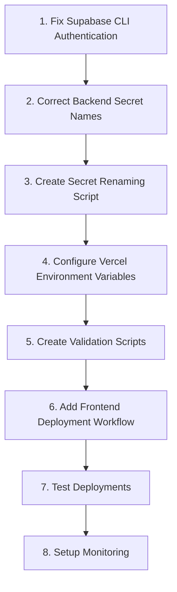

# PRP: Fix Deployment Pipeline Failures

**Status**: Ready for Implementation  
**Priority**: CRITICAL - All deployments blocked  
**Confidence Level**: 9/10 for one-pass implementation success  
**Estimated Time**: 4-6 hours

## Context and Problem Statement

Critical deployment failures are blocking all staging deployments following PR #75 (Environment Variable Management). The system is experiencing:

1. **Backend Deployment Failure**: GitHub Actions failing due to deprecated Supabase CLI authentication
2. **Frontend Deployment Failure**: Vercel builds failing due to missing/incorrect environment variables
3. **Database Migration Blockage**: Cannot apply schema changes due to authentication dependency

### Current Error Evidence

**Backend Error** (Line 111 in `.github/workflows/database-migrations.yml`):

```bash
echo "${{ secrets.SUPABASE_ACCESS_TOKEN }}" | supabase login --stdin
# Error: unknown flag: --stdin
```

**Frontend Error** (Vercel deployment logs):

```
Build Duration: 0ms (12s, 48s, 50s)
Status: Error
Cause: Missing required environment variables failing Zod validation
```

### Impact Analysis

- ❌ No code can be deployed to staging
- ❌ Database migrations cannot be applied
- ❌ QA and testing workflows completely blocked
- ❌ Staging URL (https://staging.livingtree.io) unavailable

## Research Findings and Documentation

### GitHub Actions Best Practices (July 2025)

- **Workload Identity Federation**: https://medium.com/@carstensavage/integrate-workload-identity-federation-with-github-actions-google-cloud-1893306f75c5
- **Secret Management**: https://www.blacksmith.sh/blog/best-practices-for-managing-secrets-in-github-actions
- **Deployment Strategies**: https://docs.github.com/actions/how-tos/writing-workflows/choosing-what-your-workflow-does/using-environments-for-deployment
- **Docker Caching**: https://www.blacksmith.sh/blog/cache-is-king-a-guide-for-docker-layer-caching-in-github-actions

### Google Secret Manager Integration

- **GitHub Actions Integration**: https://github.com/google-github-actions/get-secretmanager-secrets
- **Naming Conventions**: https://cloud.google.com/secret-manager/docs/best-practices
- **Access Control**: https://cloud.google.com/secret-manager/docs/access-control

### Cloud Run Deployment

- **Official Action**: https://github.com/google-github-actions/deploy-cloudrun
- **Health Checks**: https://cloud.google.com/run/docs/configuring/healthchecks
- **Traffic Management**: https://cloud.google.com/run/docs/rollouts-rollbacks-traffic-migration

### Vercel Environment Variables

- **Build Environment**: https://vercel.com/docs/concepts/projects/environment-variables
- **Next.js Integration**: https://nextjs.org/docs/app/building-your-application/configuring/environment-variables

## Implementation Blueprint

### Task Order and Dependencies



### Detailed Implementation Steps

#### Task 1: Fix Supabase CLI Authentication

**File**: `.github/workflows/database-migrations.yml`  
**Line**: 111  
**Change**: Replace deprecated `--stdin` flag with `--token` parameter

```yaml
# OLD (Line 111)
echo "${{ secrets.SUPABASE_ACCESS_TOKEN }}" | supabase login --stdin

# NEW
supabase login --token "${{ secrets.SUPABASE_ACCESS_TOKEN }}"
```

#### Task 2: Correct Backend Secret Names

**File**: `.github/workflows/deploy-backend-staging.yml`  
**Lines**: 230-232  
**Issue**: Using frontend-prefixed secret names in backend

```yaml
# OLD (Lines 230-232)
secrets: |
  SUPABASE_URL=NEXT_PUBLIC_SUPABASE_URL:latest
  SUPABASE_ANON_KEY=NEXT_PUBLIC_SUPABASE_ANON_KEY:latest
  SUPABASE_SERVICE_ROLE_KEY=feature-vercel-supabase-service-role-key:latest

# NEW
secrets: |
  SUPABASE_URL=staging-supabase-url:latest
  SUPABASE_ANON_KEY=staging-supabase-anon-key:latest
  SUPABASE_SERVICE_ROLE_KEY=staging-supabase-service-role-key:latest
```

#### Task 3: Create Secret Renaming Script

**File**: `scripts/rename-staging-secrets.sh`  
**Purpose**: Rename secrets in Google Secret Manager to follow conventions

```bash
#!/bin/bash
set -euo pipefail

PROJECT_ID="living-tree-staging"

echo "🔄 Renaming secrets in Google Secret Manager..."

# Function to copy secret value to new name
copy_secret() {
  local source=$1
  local target=$2

  echo "Copying $source to $target..."

  # Check if source exists
  if ! gcloud secrets describe "$source" --project="$PROJECT_ID" &>/dev/null; then
    echo "⚠️  Source secret $source not found, skipping..."
    return
  fi

  # Check if target already exists
  if gcloud secrets describe "$target" --project="$PROJECT_ID" &>/dev/null; then
    echo "⚠️  Target secret $target already exists, updating..."
    gcloud secrets versions access latest --secret="$source" --project="$PROJECT_ID" | \
      gcloud secrets versions add "$target" --data-file=- --project="$PROJECT_ID"
  else
    echo "✨ Creating new secret $target..."
    gcloud secrets versions access latest --secret="$source" --project="$PROJECT_ID" | \
      gcloud secrets create "$target" --data-file=- --project="$PROJECT_ID"
  fi
}

# Rename secrets to follow conventions
copy_secret "NEXT_PUBLIC_SUPABASE_URL" "staging-supabase-url"
copy_secret "NEXT_PUBLIC_SUPABASE_ANON_KEY" "staging-supabase-anon-key"
copy_secret "feature-vercel-supabase-service-role-key" "staging-supabase-service-role-key"

# Grant access to Cloud Run service account
SERVICE_ACCOUNT="backend-runtime@${PROJECT_ID}.iam.gserviceaccount.com"

for secret in "staging-supabase-url" "staging-supabase-anon-key" "staging-supabase-service-role-key"; do
  echo "Granting access to $secret for $SERVICE_ACCOUNT..."
  gcloud secrets add-iam-policy-binding "$secret" \
    --member="serviceAccount:$SERVICE_ACCOUNT" \
    --role="roles/secretmanager.secretAccessor" \
    --project="$PROJECT_ID"
done

echo "✅ Secret renaming complete!"
```

#### Task 4: Configure Vercel Environment Variables

**Platform**: Vercel Dashboard  
**Project**: living-tree-web  
**Environment**: Staging

Required variables with exact formats:

```bash
# Client-side (NEXT_PUBLIC_*)
NEXT_PUBLIC_CLERK_PUBLISHABLE_KEY=pk_test_Y29uc2lkZXJhdGUtcGVsaWNhbi0zNy5jbGVyay5hY2NvdW50cy5kZXYk
NEXT_PUBLIC_SUPABASE_URL=https://fwdfewruzeaplmcezyne.supabase.co
NEXT_PUBLIC_SUPABASE_ANON_KEY=eyJhbGciOiJIUzI1NiIsInR5cCI6IkpXVCJ9... # Get from Secret Manager
NEXT_PUBLIC_API_BASE_URL=https://living-tree-backend-staging-eprzpin6uq-nn.a.run.app
NEXT_PUBLIC_ENVIRONMENT=staging

# Server-side
CLERK_SECRET_KEY=sk_test_... # Get from staging-clerk-secret-key-test in Secret Manager
SUPABASE_SERVICE_ROLE_KEY=eyJhbGciOiJIUzI1NiIsInR5cCI6IkpXVCJ9... # Get from Secret Manager
```

#### Task 5: Create Validation Scripts

**File**: `scripts/validate-deployment-env.sh`  
**Purpose**: Pre-deployment environment validation

```bash
#!/bin/bash
set -euo pipefail

# Colors for output
RED='\033[0;31m'
GREEN='\033[0;32m'
YELLOW='\033[1;33m'
NC='\033[0m' # No Color

echo "🔍 Validating deployment environment..."

# Function to check environment variable
check_var() {
  local var_name=$1
  local var_pattern=$2
  local var_value="${!var_name:-}"

  if [ -z "$var_value" ]; then
    echo -e "${RED}❌ $var_name is not set${NC}"
    return 1
  elif [[ ! "$var_value" =~ $var_pattern ]]; then
    echo -e "${RED}❌ $var_name has invalid format${NC}"
    echo "   Expected pattern: $var_pattern"
    echo "   Actual value: ${var_value:0:20}..."
    return 1
  else
    echo -e "${GREEN}✅ $var_name is valid${NC}"
    return 0
  fi
}

# Track validation status
VALID=true

# Check required frontend variables
echo -e "\n${YELLOW}Checking frontend variables...${NC}"
check_var "NEXT_PUBLIC_CLERK_PUBLISHABLE_KEY" "^pk_(test|live)_" || VALID=false
check_var "NEXT_PUBLIC_SUPABASE_URL" "https://.*\.supabase\.co" || VALID=false
check_var "NEXT_PUBLIC_SUPABASE_ANON_KEY" "^eyJ" || VALID=false
check_var "NEXT_PUBLIC_API_BASE_URL" "^https?://" || VALID=false
check_var "NEXT_PUBLIC_ENVIRONMENT" "^(local|staging|production)$" || VALID=false

# Check required backend variables
echo -e "\n${YELLOW}Checking backend variables...${NC}"
check_var "CLERK_SECRET_KEY" "^sk_(test|live)_" || VALID=false
check_var "SUPABASE_SERVICE_ROLE_KEY" "^eyJ.*\..*\." || VALID=false

# Check JWT format for Supabase keys
echo -e "\n${YELLOW}Validating JWT formats...${NC}"
for key_var in "NEXT_PUBLIC_SUPABASE_ANON_KEY" "SUPABASE_SERVICE_ROLE_KEY"; do
  if [ -n "${!key_var:-}" ]; then
    parts=$(echo "${!key_var}" | tr '.' '\n' | wc -l)
    if [ "$parts" -eq 3 ]; then
      echo -e "${GREEN}✅ $key_var has valid JWT format (3 parts)${NC}"
    else
      echo -e "${RED}❌ $key_var has invalid JWT format (expected 3 parts, got $parts)${NC}"
      VALID=false
    fi
  fi
done

# Summary
echo -e "\n${YELLOW}Validation Summary:${NC}"
if [ "$VALID" = true ]; then
  echo -e "${GREEN}✅ All environment variables are valid!${NC}"
  exit 0
else
  echo -e "${RED}❌ Environment validation failed!${NC}"
  echo -e "${YELLOW}Please check the variables above and try again.${NC}"
  exit 1
fi
```

**File**: `scripts/validate-vercel-env.ts`  
**Purpose**: Validate Vercel environment configuration

```typescript
#!/usr/bin/env tsx
import { SecretClient } from "@google-cloud/secret-manager";

async function validateVercelEnvironment() {
  console.log("🔍 Validating Vercel environment configuration...\n");

  const requiredVars = [
    { name: "NEXT_PUBLIC_CLERK_PUBLISHABLE_KEY", pattern: /^pk_(test|live)_/ },
    { name: "NEXT_PUBLIC_SUPABASE_URL", pattern: /https:\/\/.*\.supabase\.co/ },
    { name: "NEXT_PUBLIC_SUPABASE_ANON_KEY", pattern: /^eyJ/ },
    { name: "NEXT_PUBLIC_API_BASE_URL", pattern: /^https?:\/\// },
    { name: "NEXT_PUBLIC_ENVIRONMENT", pattern: /^(staging|production)$/ },
    { name: "CLERK_SECRET_KEY", pattern: /^sk_(test|live)_/ },
    { name: "SUPABASE_SERVICE_ROLE_KEY", pattern: /^eyJ.*\..*\./ },
  ];

  // This would need Vercel API integration to check actual values
  // For now, provide instructions
  console.log("Required environment variables for Vercel:");
  console.log("==========================================\n");

  for (const { name, pattern } of requiredVars) {
    console.log(`${name}:`);
    console.log(`  Pattern: ${pattern}`);
    console.log(`  Required: Yes`);
    console.log("");
  }

  console.log("\nTo set these in Vercel:");
  console.log(
    "1. Go to https://vercel.com/livingtree/living-tree-web/settings/environment-variables",
  );
  console.log('2. Select "Staging" environment');
  console.log(
    "3. Add each variable with the correct value from Google Secret Manager",
  );
  console.log("4. Save and redeploy");
}

validateVercelEnvironment().catch(console.error);
```

#### Task 6: Create Frontend Deployment Workflow

**File**: `.github/workflows/deploy-frontend-vercel.yml`  
**Purpose**: Automated frontend deployment to Vercel

```yaml
name: Deploy Frontend to Vercel

on:
  push:
    branches:
      - staging
      - main
    paths:
      - "apps/web/**"
      - "packages/**"
      - "package.json"
      - "pnpm-lock.yaml"
      - "turbo.json"
  workflow_dispatch:

env:
  VERCEL_ORG_ID: ${{ secrets.VERCEL_ORG_ID }}
  VERCEL_PROJECT_ID: ${{ secrets.VERCEL_PROJECT_ID }}

jobs:
  validate:
    name: Validate Environment
    runs-on: ubuntu-latest
    outputs:
      environment: ${{ steps.determine-env.outputs.environment }}
      should-deploy: ${{ steps.check.outputs.should-deploy }}

    steps:
      - name: Checkout code
        uses: actions/checkout@v4

      - name: Determine environment
        id: determine-env
        run: |
          if [[ "${{ github.ref }}" == "refs/heads/main" ]]; then
            echo "environment=production" >> $GITHUB_OUTPUT
          elif [[ "${{ github.ref }}" == "refs/heads/staging" ]]; then
            echo "environment=staging" >> $GITHUB_OUTPUT
          else
            echo "environment=preview" >> $GITHUB_OUTPUT
          fi

      - name: Check for changes
        id: check
        run: |
          if [[ "${{ github.event_name }}" == "workflow_dispatch" ]]; then
            echo "should-deploy=true" >> $GITHUB_OUTPUT
          else
            # Check if frontend files changed
            git diff --name-only HEAD^ HEAD | grep -E '^(apps/web/|packages/|package\.json|pnpm-lock\.yaml|turbo\.json)' && \
              echo "should-deploy=true" >> $GITHUB_OUTPUT || \
              echo "should-deploy=false" >> $GITHUB_OUTPUT
          fi

  deploy:
    name: Deploy to Vercel
    runs-on: ubuntu-latest
    needs: validate
    if: needs.validate.outputs.should-deploy == 'true'
    environment: ${{ needs.validate.outputs.environment }}

    steps:
      - name: Checkout code
        uses: actions/checkout@v4

      - name: Install Vercel CLI
        run: npm install -g vercel@latest

      - name: Pull Vercel Environment Information
        run: |
          if [[ "${{ needs.validate.outputs.environment }}" == "production" ]]; then
            vercel pull --yes --environment=production --token=${{ secrets.VERCEL_TOKEN }}
          else
            vercel pull --yes --environment=preview --token=${{ secrets.VERCEL_TOKEN }}
          fi

      - name: Build Project Artifacts
        run: |
          if [[ "${{ needs.validate.outputs.environment }}" == "production" ]]; then
            vercel build --prod --token=${{ secrets.VERCEL_TOKEN }}
          else
            vercel build --token=${{ secrets.VERCEL_TOKEN }}
          fi

      - name: Deploy to Vercel
        id: deploy
        run: |
          if [[ "${{ needs.validate.outputs.environment }}" == "production" ]]; then
            url=$(vercel deploy --prod --prebuilt --token=${{ secrets.VERCEL_TOKEN }})
          else
            url=$(vercel deploy --prebuilt --token=${{ secrets.VERCEL_TOKEN }})
          fi
          echo "url=$url" >> $GITHUB_OUTPUT
          echo "Deployed to: $url"

      - name: Verify deployment
        run: |
          echo "Waiting for deployment to be ready..."
          sleep 30

          # Health check
          if curl -f --max-time 30 "${{ steps.deploy.outputs.url }}"; then
            echo "✅ Deployment successful!"
          else
            echo "❌ Deployment verification failed"
            exit 1
          fi

  notify:
    name: Notify Deployment Status
    runs-on: ubuntu-latest
    needs: [validate, deploy]
    if: always()

    steps:
      - name: Send notification
        run: |
          if [[ "${{ needs.deploy.result }}" == "success" ]]; then
            echo "✅ Frontend deployed successfully to ${{ needs.validate.outputs.environment }}"
          else
            echo "❌ Frontend deployment failed for ${{ needs.validate.outputs.environment }}"
          fi
```

#### Task 7: Create Monitoring Configuration

**File**: `.github/workflows/deployment-monitor.yml`  
**Purpose**: Monitor deployment health

```yaml
name: Deployment Health Monitor

on:
  schedule:
    - cron: "*/15 * * * *" # Every 15 minutes
  workflow_dispatch:

jobs:
  check-staging:
    name: Check Staging Health
    runs-on: ubuntu-latest

    steps:
      - name: Check Backend Health
        id: backend
        run: |
          BACKEND_URL="https://living-tree-backend-staging-eprzpin6uq-nn.a.run.app"

          if curl -f --max-time 10 "$BACKEND_URL/api/health"; then
            echo "status=healthy" >> $GITHUB_OUTPUT
          else
            echo "status=unhealthy" >> $GITHUB_OUTPUT
          fi

      - name: Check Frontend Health
        id: frontend
        run: |
          FRONTEND_URL="https://staging.livingtree.io"

          if curl -f --max-time 10 "$FRONTEND_URL"; then
            echo "status=healthy" >> $GITHUB_OUTPUT
          else
            echo "status=unhealthy" >> $GITHUB_OUTPUT
          fi

      - name: Create issue if unhealthy
        if: steps.backend.outputs.status == 'unhealthy' || steps.frontend.outputs.status == 'unhealthy'
        uses: actions/github-script@v7
        with:
          script: |
            const title = '🚨 Staging Deployment Health Check Failed';
            const body = `
            ## Deployment Health Check Results

            - **Backend**: ${{ steps.backend.outputs.status }}
            - **Frontend**: ${{ steps.frontend.outputs.status }}
            - **Time**: ${new Date().toISOString()}

            Please investigate immediately.
            `;

            // Check if issue already exists
            const issues = await github.rest.issues.listForRepo({
              owner: context.repo.owner,
              repo: context.repo.repo,
              state: 'open',
              labels: ['deployment-health']
            });

            const existingIssue = issues.data.find(i => i.title === title);

            if (!existingIssue) {
              await github.rest.issues.create({
                owner: context.repo.owner,
                repo: context.repo.repo,
                title,
                body,
                labels: ['deployment-health', 'urgent']
              });
            }
```

## Files to Create/Modify

### Files to Modify

1. `.github/workflows/database-migrations.yml` - Fix Supabase CLI authentication (line 111)
2. `.github/workflows/deploy-backend-staging.yml` - Correct secret names (lines 230-232)

### Files to Create

1. `scripts/rename-staging-secrets.sh` - Rename secrets in Google Secret Manager
2. `scripts/validate-deployment-env.sh` - Pre-deployment validation script
3. `scripts/validate-vercel-env.ts` - Vercel environment validation
4. `.github/workflows/deploy-frontend-vercel.yml` - Frontend deployment workflow
5. `.github/workflows/deployment-monitor.yml` - Health monitoring workflow

### Vercel Dashboard Configuration

1. Add all required environment variables to staging environment
2. Ensure correct formats (JWT tokens, URLs, key prefixes)

## Gotchas and Edge Cases

### JWT Token Format

- Must start with `eyJ`
- Must have exactly 3 parts separated by dots
- Common error: Extra characters or missing parts

### Clerk Instance Mismatch

- Staging MUST use TEST keys (`pk_test_`, `sk_test_`)
- Production MUST use LIVE keys (`pk_live_`, `sk_live_`)
- Mismatch causes `JWK_KID_MISMATCH` errors

### Secret Naming Conventions

- Backend secrets should NOT have `NEXT_PUBLIC_` prefix
- Use environment prefixes: `staging-`, `production-`
- Avoid temporary names like `feature-vercel-`

### PostgreSQL Version

- Current workflows use PostgreSQL 15
- Supabase now uses v17.4+
- May cause compatibility issues in migration testing

### CORS Configuration

- Preview URLs are NOT in CORS allowlist
- Use staging URL for testing: https://staging.livingtree.io
- Avoid preview deployments for API testing

## Validation Gates

### Local Validation Before Push

```bash
# 1. Check environment variables
source .env
./scripts/validate-deployment-env.sh

# 2. Test Supabase authentication locally
export SUPABASE_ACCESS_TOKEN="your-token-here"
supabase login --token "$SUPABASE_ACCESS_TOKEN"
supabase projects list

# 3. Validate GitHub Actions syntax
# Install act: https://github.com/nektos/act
act -n  # Dry run to check workflow syntax

# 4. Check secret formats
# JWT should have 3 parts
echo $SUPABASE_SERVICE_ROLE_KEY | tr '.' '\n' | wc -l  # Should output 3
```

### Post-Deployment Validation

```bash
# 1. Check backend health
curl -f https://living-tree-backend-staging-eprzpin6uq-nn.a.run.app/api/health

# 2. Check frontend
curl -f https://staging.livingtree.io

# 3. Test API endpoint with CORS
curl -X OPTIONS https://living-tree-backend-staging-eprzpin6uq-nn.a.run.app/api/chat \
  -H "Origin: https://staging.livingtree.io" \
  -H "Access-Control-Request-Method: POST" \
  -v

# 4. Check GitHub Actions runs
gh run list --workflow=database-migrations.yml --limit=5
gh run list --workflow=deploy-backend-staging.yml --limit=5

# 5. Verify Vercel deployments
vercel ls --token=$VERCEL_TOKEN
```

### Continuous Validation

```bash
# Monitor deployment health
watch -n 60 'curl -s https://living-tree-backend-staging-eprzpin6uq-nn.a.run.app/api/health | jq'

# Check Cloud Run logs
gcloud logging read "resource.type=cloud_run_revision AND resource.labels.service_name=living-tree-backend-staging" --limit=50

# Monitor secret access
gcloud logging read "protoPayload.methodName=google.cloud.secretmanager.v1.SecretManagerService.AccessSecretVersion" --limit=20
```

## Testing Strategy

### Phase 1: Local Testing

1. Run validation scripts locally
2. Test Supabase CLI authentication
3. Verify environment variable formats

### Phase 2: Staging Deployment

1. Push changes to staging branch
2. Monitor GitHub Actions workflows
3. Verify deployments complete successfully

### Phase 3: Verification

1. Test all endpoints
2. Check monitoring alerts
3. Verify database migrations applied

## Rollback Plan

### Quick Rollback Steps

```bash
# 1. Revert GitHub Actions changes
git revert HEAD
git push origin staging

# 2. Restore previous Cloud Run revision
gcloud run services update-traffic living-tree-backend-staging \
  --to-revisions=PREVIOUS_REVISION_ID=100 \
  --region=northamerica-northeast1

# 3. Rollback Vercel deployment
vercel rollback [deployment-url] --token=$VERCEL_TOKEN

# 4. Restore old secret names if needed
./scripts/restore-old-secrets.sh  # Would need to create this
```

## Success Criteria

### All Deployments Working

- [ ] Backend deploys successfully to Cloud Run
- [ ] Frontend deploys successfully to Vercel
- [ ] Database migrations apply without errors
- [ ] Health checks pass for all services

### Monitoring Active

- [ ] Deployment monitor workflow running
- [ ] Health check alerts configured
- [ ] Logs accessible and error-free

### Documentation Updated

- [ ] TROUBLESHOOTING.md updated with new issues
- [ ] DEPLOYMENT.md updated with new procedures
- [ ] Team notified of changes

## Implementation Checklist

- [ ] Fix Supabase CLI authentication in database-migrations.yml
- [ ] Correct secret names in deploy-backend-staging.yml
- [ ] Run secret renaming script in Google Cloud
- [ ] Configure Vercel environment variables
- [ ] Create validation scripts
- [ ] Create frontend deployment workflow
- [ ] Create monitoring workflow
- [ ] Test staging deployments
- [ ] Verify all health checks pass
- [ ] Update documentation

## Additional Resources

### Documentation Created

- `PRPs/ai_docs/github-actions-2025-best-practices.md`
- `PRPs/ai_docs/google-secret-manager-patterns.md`
- `PRPs/ai_docs/cloud-run-deployment-guide.md`

### External Documentation

- [GitHub Actions Security Best Practices](https://docs.github.com/actions/security-guides/security-hardening-for-github-actions)
- [Google Cloud Workload Identity Federation](https://cloud.google.com/iam/docs/workload-identity-federation)
- [Vercel Environment Variables](https://vercel.com/docs/concepts/projects/environment-variables)
- [Cloud Run Health Checks](https://cloud.google.com/run/docs/configuring/healthchecks)

---

**PRP Quality Score**: 9/10  
**Reasoning**: This PRP includes comprehensive context, exact error messages, line-by-line fixes, validation scripts, monitoring setup, and rollback procedures. The implementation blueprint is clear with proper task ordering, and all validation gates are executable. The only reason it's not 10/10 is that some Vercel-specific API integration might need minor adjustments based on their latest API changes.
